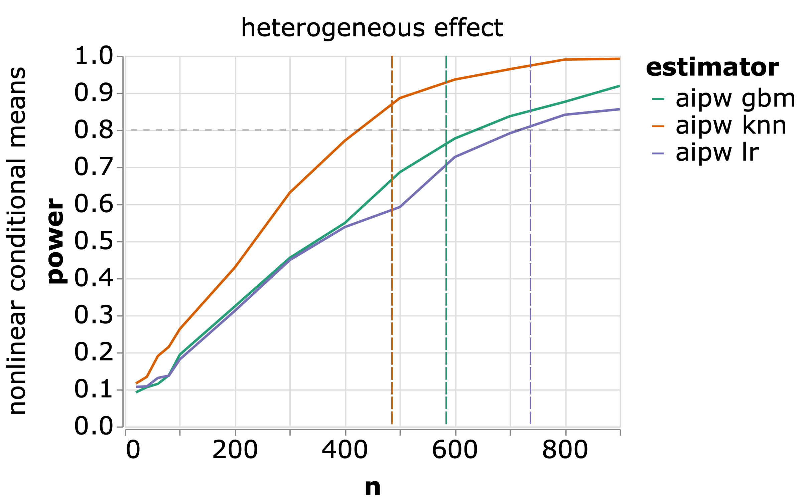

## COI, Funding, Disclaimer.

- research editor at The BMJ
- consulting for iHeed Medical Education

- research funded by R01AI157758
- all errors are mine

## Intention to Treat (ITT)

- ITT estimators are unbiased in randomized trials

- Robust property derives from leveraging randomization to assure exchangeability in expectation (in addition to other identifiability conditions)

- ITT is often imprecise due to lack of covariate predictor adjustment

- However, even with covariate adjustment, strong assumptions are made about the relationship between covariates and the outcome

::: {.center data-latex=""}
Can we do more?
:::

## Background of the AIPW estimator

- 1994 JASA Robins, Rotnizky and Zhao
- 2006 Tsiatis 'Semiparametric Theory and Missing Data'

$$
\hat{\mu}_{1}=n_{1}^{-1} \sum_{i=1}^{n_{1}}\left[\frac{R_{i} Y_{1 i}}{\pi\left(W_{i}, \hat{\gamma}_{3}\right)}-\frac{\left\{R_{i}-\pi\left(W_{i}, \hat{\gamma}_{3}\right)\right\}}{\pi\left(W_{i}, \hat{\gamma}_{3}\right)} \mu\left(W_{i}, \hat{\gamma}_{1}\right)\right]
$$

- 2011 AJE Jonsson-Funk, Westreich, Wiesen, Sturmer, Brookhart and Davidian 'Doubly Robust Estimation of Causal Effects' 

$$
\begin{aligned}
\hat{\Delta}_{\mathrm{DR}}=& n^{-1} \sum_{i=1}^{n}\left[\frac{X_{i} Y_{i}}{e\left(\mathbf{Z}_{i}, \hat{\boldsymbol{\beta}}\right)}-\frac{\left\{X_{i}-e\left(\mathbf{Z}_{i}, \hat{\boldsymbol{\beta}}\right)\right\}}{e\left(\mathbf{Z}_{i}, \hat{\boldsymbol{\beta}}\right)} m_{1}\left(\mathbf{Z}_{i}, \hat{\alpha}_{1}\right)\right] \\
&-n^{-1} \sum_{i=1}^{n}\left[\frac{\left(1-X_{i}\right) Y_{i}}{1-e\left(\mathbf{Z}_{i}, \hat{\beta}\right)}+\frac{\left\{X_{i}-e\left(\mathbf{Z}_{i}, \hat{\beta}\right)\right\}}{1-e\left(\mathbf{Z}_{i}, \hat{\beta}\right)} m_{0}\left(\mathbf{Z}_{i}, \hat{\alpha}_{0}\right)\right]
\end{aligned}
$$


## Key Points of AIPW for ITT

- Consistent(asymptotically unbiased) under MAR and positivity even if the one of the models is wrong [^1]

- Added bonus: If both models are right then this is the most efficient estimator in its class $^1$

::: {.center data-latex=""}
\vspace{1cm}

\textit{Under RCT we are guaranteed positivity and exchangeability, and we KNOW one model is right and WHICH model is right, too.}
:::

[^1]:1 Daniel RM. Double Robustness. In: Wiley StatsRef: Statistics Reference Online. 2018. doi:10.1002/9781118445112.stat08068


## Simulation/ Proof of concept-Binary

Binary outcome

10000 monte carlo trials

$n=1000$

$Y \sim \hbox{binomial}$

$\hbox{weak, med, strong predictor, error, non predictor} \sim N(0,1)$

```{r, child=c('simulation/binary_aipw_sim.rmd'), echo=FALSE, results='hide', cache=TRUE}
```

```{r, echo=FALSE}
knitr::kable(round(estimates,digits=4))
```


## Simulation/ Proof of concept-Continuous

Continuous outcome

10000 monte carlo trials

$n=1000$

$Y \sim continuous$

```{r, child=c('simulation/simulation_project.rmd'), echo=FALSE, fig.show='hide',results='hide',cache=TRUE}
```

```{r, echo=FALSE, message=FALSE}
library(dplyr)
cont<-cont_estimates %>% select(Estimate, SE, se_ratio) 
knitr::kable(round(cont,4))
```

## Real Data

Reanalysis of ACTG 5202 data based off Sax 2009 NEJM [^2]

   - Phase 3 clinical trial
   - Comparing abacavir/lamivudine (ABC/3TC) to emtricitibine/tenofivir (TDF/FTC)
   - main outcome was time to virologic failure
   - 797 person randomized had $\geq 100,000$ HIV RNA copies/ml, were $\geq 16$years old and had at most 7 days of ART therapy
   - primary result was hazard ratio of 2.33 (1.46-3.72) for ABC/3TC versus TDF/FTC
  
[^2]:1 Sax PE et al. Abacavir–Lamivudine versus Tenofovir–Emtricitabine for Initial HIV-1 Therapy. N Engl J Med 2009;doi:10.1056/NEJMoa0906768

## Real Data-Slighty modified

In this analysis we are approaching categorical and continuous outcome--we have not pursued survival analysis,yet.

  - we used data at 48 weeks to define viral supression defined as HIV RNA copies $< 200$ copies/ml -->our binary outcome
    
  - similarly we used data at 48 weeks to define CD4 count, cells/mm^2 --> our continuous outcome
  
  - Use the g-formula as out outcome model; others models are potential candidates, too
  
    - predictors included in g-formula are 
    
        - Age(categorized, 16-24, 25-49, 50+)
        
        - log RNA level at baseline
        
        - CD4 count at baseline
        
        - Sex at birth
        
## Confidence Intervals
  
  - Bootstrapping to obtain a standard error; can also used closed form solution [^3]


Also a closed form solution available:
$$
\widehat{\mathbb{V}}\left(\widehat{\mu}_{aipw}\right)=\frac{1}{n^{2}} \sum_{i=1}^{n}
\left[\frac{R_{i} Y_{i}}{\pi\left(\mathbf{X}_{i} ; \widehat{\boldsymbol{\alpha}}\right)}+\left\{1-\frac{R_{i}}{\pi\left(\mathbf{X}_{i} ; \widehat{\boldsymbol{\alpha}}\right)}\right\} m\left(\mathbf{X}_{i} ; \widehat{\boldsymbol{\beta}}\right)-\widehat{\mu}_{aipw}\right]^{2}
$$

\vspace{0.3cm}

R code, which I think is a bit easier to read
```{r}
aipw_diff<-(aipw1-aipw0)-aipw_all_est

var_aipw<-(1/(nrow(data)^2))*sum(aipw_diff^2)
se_aipw<-sqrt(var_aipw)
```

[^3]: Learned closed form solution thanks to Paul Zivich 


## Reanalysis results

||Viral suppression at 48 weeks |SE| SE Ratio|
|:-----|:-----|:-----|:-----|
|ITT|-0.025 (-0.065,0.016)|0.0205|ref|
|AIPW|-0.020 (-0.019,0.061)| 0.0203|0.99|

||CD4 count at 48 weeks (cells/mm^2)|SE| SE Ratio|
|:-----|:-----|:-----|:-----|:-----|
|ITT|-6.85 (-38.92,25.23)|16.34|ref|
|AIPW|-6.69 (-26.94,13.57)|10.33|0.63|

## Implications

- Tighter confidence intervals from lower SE around unbiased estimates

- Efficient use of valuable data

- \alert{Sample size gains!}

## Sample Size

RCTs are typically designed with power in mind to make sure that the correct number of people are enrolled to answer a question without enrolling too many people as to make the trial unethical.

  - Power typically set at 80-90%

Using AIPW and leveraging the efficiency gains (as evident by the decrease in SE) means you can use less people to answer the same question.

Alternatively, for a study that failed to recruit the appropriate number of participants, AIPW might be a way to recover power

## Sample size improvements

As far as I know there are no closed form solutions for calculating sample size 'savings'

Simulation seems to be the best solution [^4], which requires many assumptions about the covariance structure of the data


::: {.center data-latex=""}
{width=60%}
:::


[^4]:Schuler A. Designing efficient randomized trials: power and sample size calculation when using semiparametric efficient estimators. arXiv:210410784. 2021.http://arxiv.org/abs/2104.10784

---

::: {.center data-latex=""}

:::


## Finishing up

As I finish this project I want to make sure I quantify the sample size improvements we should be able to see.

Plan is to evaluate the number of observations I would need to add to my data to achieve the SE of the ITT estimate.

## Thank you

Many awesome people helped me with this project, taught me, and tolerated code review sessions.

- Steve Cole
- Jess Edwards
- Paul Zivich
- Rachael Ross
- Catherine Li
- Lauren Zalla
- Audrey Renson
